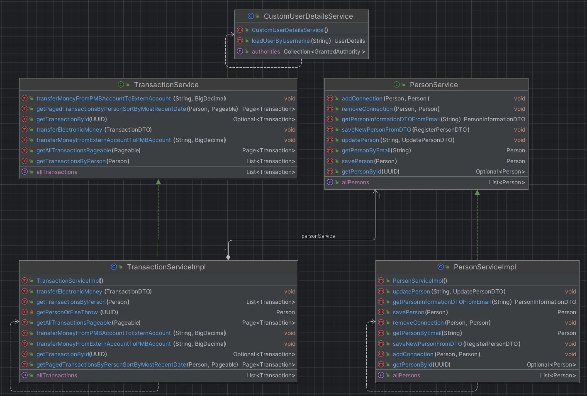
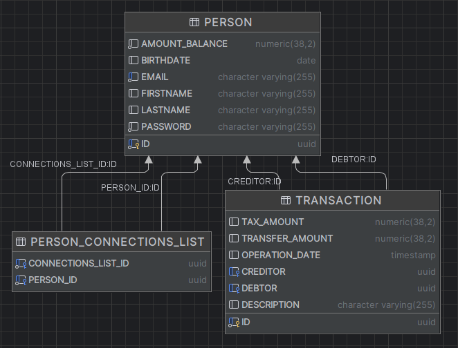
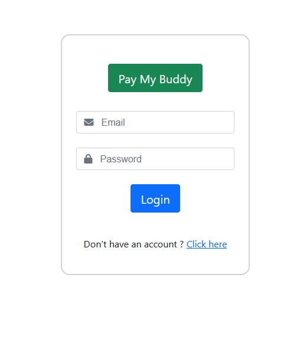
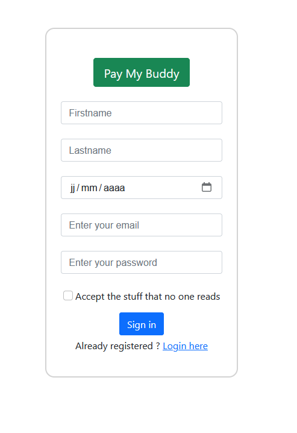
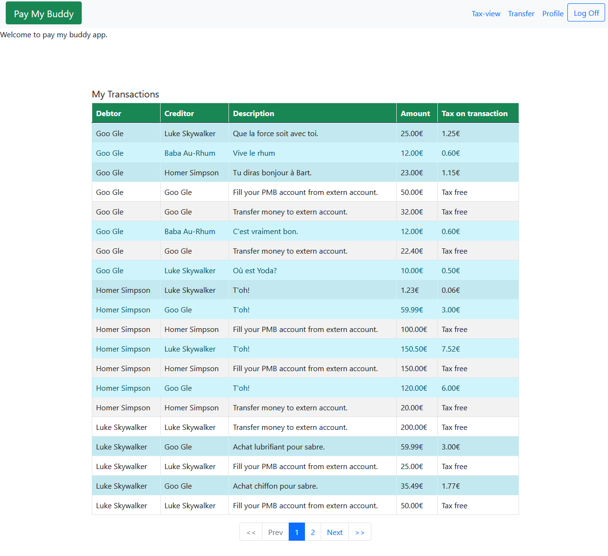
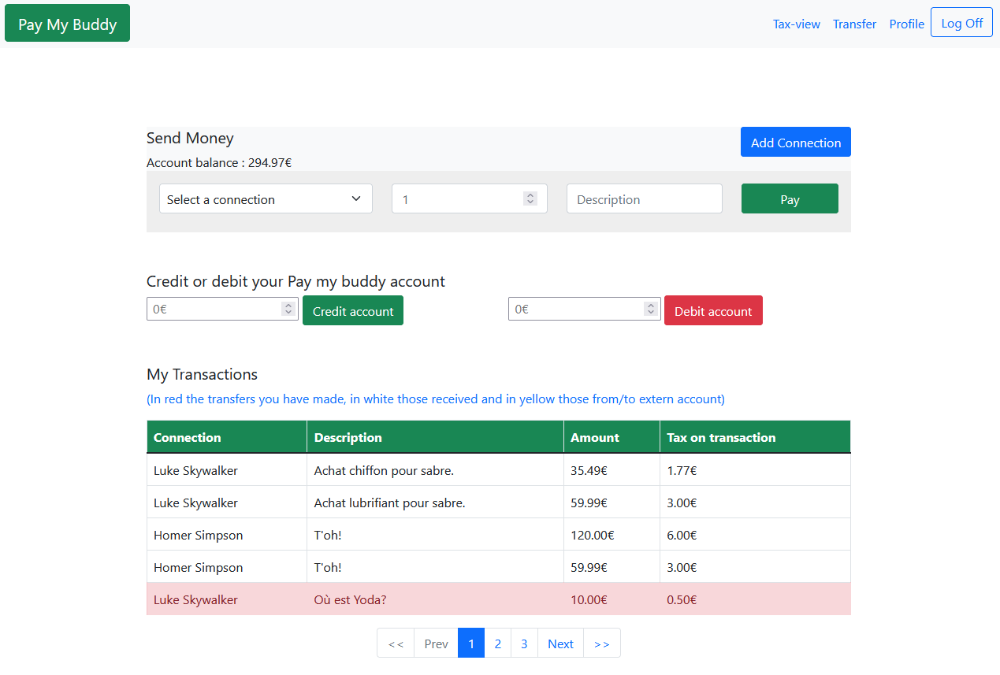
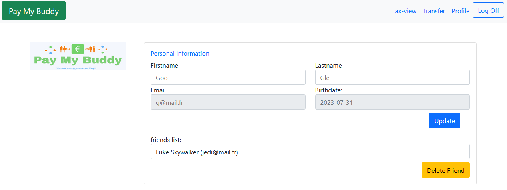

# Darves-Bornoz_Giovanni_PayMyBuddy

PayMyBuddy,an Openclassrooms project.  
A project that aims to develop a web application to easily exchange money.

## Technologies
* Java 17
* Maven
* Spring Boot 3.1.1
* Spring Data JPA
* Spring Security
* Spring Actuator 
* Database H2
* Bootstrap 5.1.3
* Thymeleaf 3.1.2
* Java faker 1.0.2
* Lombok 1.18.28

## Usage
1. Open project
2. Run the application, the database will set up automatically
3. Go to http://localhost:8080/login
4. Create a new account using register page (click on "Click here" under the login button) or use this Email/Password : "g@mail.fr" - "a".
5. On the transfer page make the transfers you want.
6. On the profile page, manage your account and friend list.
7. On the Tax-view page (future admin page only), view all transactions and related taxes.

If you want to watch database's data go to http://localhost:8080/h2-console (refer to application.properties to see username and password)

# UML class diagram

# Physical data model

# Screenshot
### Login page

### Register page

### Transfer/tax view 

### Transfer page 

### Profile page
